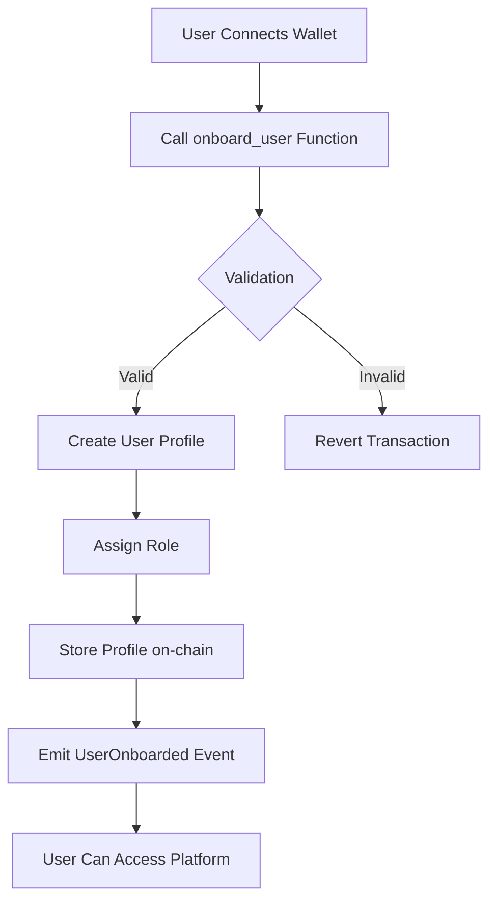
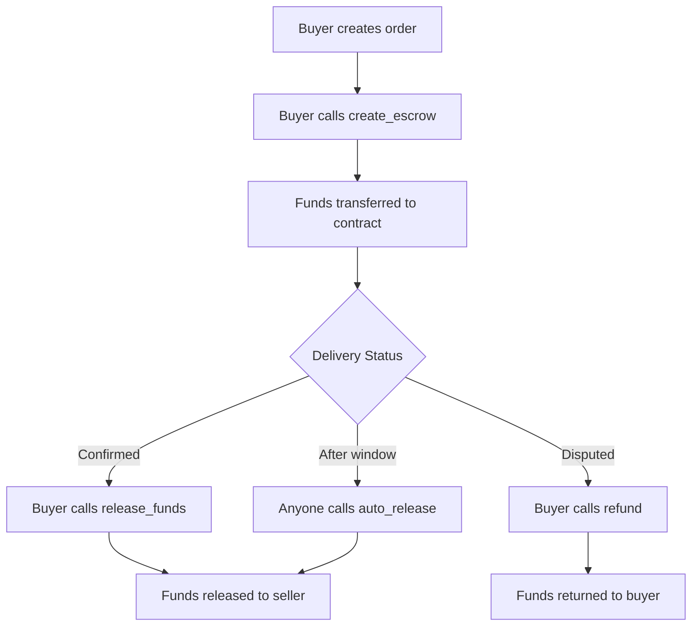

# CraftNexus Smart Contracts

Stellar Smart Contracts (Soroban) for the CraftNexus marketplace platform.

## Table of Contents

- [Overview](#overview)
- [Contracts](#contracts)
  - [Onboarding Contract](#onboarding-contract)
  - [Escrow Contract](#escrow-contract)
- [Storage Architecture](#storage-architecture)
- [Event Reference](#event-reference)
- [Versioned State Migration](#versioned-state-migration)
- [Error Codes](#error-codes)
- [Prerequisites](#prerequisites)
- [Building Contracts](#building-contracts)
- [Deployment](#deployment)
- [Testing Contracts](#testing-contracts)
- [Integration](#integration)
- [Arbitrator Role](#arbitrator-role)
- [Contract Addresses](#contract-addresses)
- [Security Considerations](#security-considerations)

---

## Overview

CraftNexus uses Stellar Soroban smart contracts to provide secure, decentralized functionality for the handmade marketplace platform. The system consists of two main contracts:

1. **Onboarding Contract** - Manages user registration, role assignment, and platform access
2. **Escrow Contract** - Handles secure payment holding for marketplace transactions

## Versioned State Migration

State migration notes for the `Escrow` and `UserProfile` versioned schemas live in [docs/versioned-state-migration.md](docs/versioned-state-migration.md).

---

## Contracts

### Onboarding Contract

The Onboarding Contract manages user registration and role assignment for the CraftNexus platform. It provides a secure way for users to join the platform with specific roles that determine their permissions and capabilities.

#### Purpose

The onboarding contract solves several key problems within CraftNexus:

- **User Identity Management**: Establishes a verified user base with unique identities
- **Role-Based Access Control**: Assigns appropriate roles (Buyer/Artisan) to control platform capabilities
- **Platform Security**: Prevents unauthorized access and ensures only legitimate users can participate
- **Transparency**: Creates an auditable record of all platform participants

#### System Architecture

```
┌─────────────────────────────────────────────────────────────┐
│                    CraftNexus Platform                      │
├─────────────────────────────────────────────────────────────┤
│                                                               │
│  ┌──────────────┐    ┌──────────────────┐    ┌───────────┐  │
│  │    User      │───▶│ Onboarding       │───▶│  Role     │  │
│  │  (Wallet)    │    │   Contract       │    │ Assignment│  │
│  └──────────────┘    └──────────────────┘    └───────────┘  │
│                              │                     │          │
│                              ▼                     ▼          │
│                      ┌──────────────────┐    ┌───────────┐    │
│                      │  User Profile    │◀───│  Escrow   │    │
│                      │  Storage         │    │  Contract │    │
│                      └──────────────────┘    └───────────┘    │
│                                                               │
└─────────────────────────────────────────────────────────────┘
```

#### User Roles

The platform supports four user roles:

| Role | Description | Capabilities |
|------|-------------|--------------|
| `None` | User has not onboarded | No platform access |
| `Buyer` | Standard customer | Browse, purchase, create orders |
| `Artisan` | Seller/crafter | Create listings, receive payments, manage shop |
| `Admin` | Platform administrator | Verify users, manage roles, platform settings |
| `Arbitrator` | Dispute resolver | Resolve disputes between buyers and sellers |

---

### Onboarding Contract Functional Flow

#### Complete Onboarding Lifecycle



#### Onboarding Steps

1. **User connects wallet** - User authenticates with their Stellar wallet (Freighter, Albedo, etc.)
2. **User calls `onboard_user` function** - Initiates the registration process
3. **Contract validates requirements** - Checks username, role, and existing registration
4. **Contract updates user state** - Creates profile with assigned role
5. **Events are emitted** - `UserOnboarded` event signals successful registration

---

### Onboarding Contract Functions

#### `initialize`

Initialize the onboarding contract with an administrator.

**Description:** Sets up the contract configuration and assigns the platform admin.

**Parameters:**
- `admin (address)` – Wallet address of the platform administrator

**Behavior:**
- Stores contract configuration
- Assigns admin role to the specified address
- Creates initial admin profile

**Reverts if:**
- Contract already initialized

**Example CLI interaction:**
```bash
stellar contract invoke \
  --id <ONBOARDING_CONTRACT_ID> \
  --source <ADMIN_SECRET> \
  --network testnet \
  -- \
  initialize \
  --admin GXXXX...XXXX
```

---

#### `onboard_user`

Register a new user on the CraftNexus platform.

**Description:** Creates a new user profile with the specified role (Buyer or Artisan).

**Parameters:**
- `user (address)` – User's wallet address
- `username (string)` – Desired username (3-50 characters)
- `role (u32)` – Desired role (1 = Buyer, 2 = Artisan)

**Behavior:**
- Validates user authentication
- Checks username length requirements (3-50 characters)
- Ensures user is not already onboarded
- Creates user profile with specified role
- Emits `UserOnboarded` event

**Reverts if:**
- User already onboarded
- Username too short (< 3 characters)
- Username too long (> 50 characters)
- Invalid role specified (not Buyer or Artisan)

**Example CLI interaction:**
```bash
# Onboard as a buyer
stellar contract invoke \
  --id <ONBOARDING_CONTRACT_ID> \
  --source <USER_SECRET> \
  --network testnet \
  -- \
  onboard_user \
  --user GXXXX...XXXX \
  --username "artisan_jane" \
  --role 2

# Onboard as a buyer  
stellar contract invoke \
  --id <ONBOARDING_CONTRACT_ID> \
  --source <USER_SECRET> \
  --network testnet \
  -- \
  onboard_user \
  --user GXXXX...XXXX \
  --username "buyer_john" \
  --role 1
```

**Example TypeScript interaction:**
```typescript
import { Contract } from 'stellar-sdk';

const onboardingContract = new Contract(ONBOARDING_CONTRACT_ID);

const result = await onboardingContract.invoke({
  method: 'onboard_user',
  args: [
    addressToSCVal(userAddress, 'address'),
    addressToSCVal(username, 'string'), 
    uint32ToSCVal(2) // UserRole::Artisan
  ]
});
```

---

#### `get_user`

Retrieve user profile information.

**Description:** Fetches the complete user profile for a given address.

**Parameters:**
- `user (address)` – User's wallet address

**Returns:**
- `UserProfile` struct containing:
  - `address` - User's wallet address
  - `role` - User's role (0=None, 1=Buyer, 2=Artisan, 3=Admin)
  - `username` - User's username
  - `registered_at` - Unix timestamp of registration
  - `is_verified` - Verification status

**Reverts if:**
- User not found (not onboarded)

**Example CLI interaction:**
```bash
stellar contract invoke \
  --id <ONBOARDING_CONTRACT_ID> \
  --source <USER_SECRET> \
  --network testnet \
  -- \
  get_user \
  --user GXXXX...XXXX
```

---

#### `get_user_role`

Get user's current role.

**Description:** Returns the role assigned to a user without fetching the full profile.

**Parameters:**
- `user (address)` – User's wallet address

**Returns:**
- `u32` - Role value (0=None, 1=Buyer, 2=Artisan, 3=Admin)

**Example CLI interaction:**
```bash
stellar contract invoke \
  --id <ONBOARDING_CONTRACT_ID> \
  --network testnet \
  -- \
  get_user_role \
  --user GXXXX...XXXX
```

---

#### `is_onboarded`

Check if user has completed onboarding.

**Description:** Quick check to determine if a wallet address has registered on the platform.

**Parameters:**
- `user (address)` – User's wallet address

**Returns:**
- `bool` - true if user is onboarded, false otherwise

**Example CLI interaction:**
```bash
stellar contract invoke \
  --id <ONBOARDING_CONTRACT_ID> \
  --network testnet \
  -- \
  is_onboarded \
  --user GXXXX...XXXX
```

---

#### `update_user_role`

Update user's role (Admin only).

**Description:** Allows the platform administrator to change a user's role.

**Parameters:**
- `user (address)` – User's wallet address to update
- `new_role (u32)` – New role to assign (0=None, 1=Buyer, 2=Artisan, 3=Admin)

**Behavior:**
- Validates caller is the platform admin
- Updates the user's role
- Emits `RoleUpdated` event

**Reverts if:**
- Caller is not the platform administrator
- User not found

**Example CLI interaction:**
```bash
stellar contract invoke \
  --id <ONBOARDING_CONTRACT_ID> \
  --source <ADMIN_SECRET> \
  --network testnet \
  -- \
  update_user_role \
  --user GXXXX...XXXX \
  --new_role 3
```

---

#### `verify_user`

Verify a user (Admin only).

**Description:** Allows the platform administrator to verify a user, granting them additional trust.

**Parameters:**
- `user (address)` – User's wallet address to verify

**Behavior:**
- Validates caller is the platform admin
- Sets user's verification status to true
- Emits `UserVerified` event

**Reverts if:**
- Caller is not the platform administrator
- User not found

**Example CLI interaction:**
```bash
stellar contract invoke \
  --id <ONBOARDING_CONTRACT_ID> \
  --source <ADMIN_SECRET> \
  --network testnet \
  -- \
  verify_user \
  --user GXXXX...XXXX
```

---

#### `has_role`

Check if user has a specific role.

**Description:** Efficiently check if a user has a particular role.

**Parameters:**
- `user (address)` – User's wallet address
- `role (u32)` – Role to check

**Returns:**
- `bool` - true if user has the specified role

**Example CLI interaction:**
```bash
stellar contract invoke \
  --id <ONBOARDING_CONTRACT_ID> \
  --network testnet \
  -- \
  has_role \
  --user GXXXX...XXXX \
  --role 2
```

#### `get_active_contract_count`

Return the precise number of active escrow contracts tracked for a user (Feature #47).

**Description:** Complements `has_active_contracts` (which only returns a boolean) by exposing the exact concurrency level maintained in `DataKey::ActiveContractCount(user)`. Off-chain indexers and reputation/risk dashboards use this to weight users by concurrent workload without replaying every escrow event or making a cross-contract call. Returns `0` when no active contracts are tracked.

**Parameters:**
- `user (address)` – User's wallet address

**Returns:**
- `u32` - number of currently-active contracts (`0` when none)

**Example CLI interaction:**
```bash
stellar contract invoke \
  --id <ONBOARDING_CONTRACT_ID> \
  --network testnet \
  -- \
  get_active_contract_count \
  --user GXXXX...XXXX
```

---

#### `admin_clear_verification_request`

Force-clear a stale or abandoned manual verification request (admin only, Issue #41).

**Description:** Privileged queue-maintenance endpoint that removes a user's pending verification request and advances the verification queue head, without approving or rejecting it. Gated behind `platform_admin.require_auth()` so unauthorized callers cannot evict legitimate users from the queue. For an audited approve/reject decision, use `process_verification_request` instead.

**Parameters:**
- `user (address)` – Address whose pending verification request should be cleared

**Returns:**
- `bool` - `true` if a pending request existed and was cleared; `false` if there was nothing to clear (idempotent no-op)

**Example CLI interaction:**
```bash
stellar contract invoke \
  --id <ONBOARDING_CONTRACT_ID> \
  --network testnet \
  --source ADMIN \
  -- \
  admin_clear_verification_request \
  --user GXXXX...XXXX
```

---

### Onboarding Contract Events

The contract emits the following events for tracking:

| Event | Description | Data Emitted |
|-------|-------------|--------------|
| `UserOnboarded` | User successfully registers | `Address` (the onboarded user) |
| `RoleUpdated` | User role changes | `Address` (the updated user) |
| `UserVerified` | User verification status changed | `Address` (the verified user) |

---

### Onboarding Contract Access Control

| Function | Access Level |
|----------|--------------|
| `initialize` | Contract deployer only |
| `onboard_user` | Any wallet (self-registration) |
| `get_user` | Public |
| `get_user_role` | Public |
| `is_onboarded` | Public |
| `has_role` | Public |
| `get_active_contract_count` | Public |
| `update_user_role` | Platform admin only |
| `verify_user` | Platform admin only |
| `admin_clear_verification_request` | Platform admin only |
| `get_config` | Public |

---

### Onboarding Contract Validation Rules

- **Username length**: 3-50 characters
- **Allowed roles for self-registration**: Buyer (1), Artisan (2)
- **Admin role**: Can only be assigned by existing admin
- **One profile per wallet**: Each wallet address can only onboard once

---

### Escrow Contract

The Escrow Contract handles secure payment holding for marketplace transactions.

#### Purpose

The escrow contract solves critical payment challenges in the CraftNexus marketplace:

- **Secure Payment Holding**: Buyer funds are held securely until delivery is confirmed
- **Automatic Release**: Funds automatically release after a configurable time window
- **Dispute Resolution**: Refund functionality for handling disagreements
- **Platform Trust**: Builds trust between buyers and artisans

#### Functional Flow



#### Contract Functions

##### `create_escrow`

Create a new escrow for an order.

**Parameters:**
- `buyer`: Buyer's Stellar address
- `seller`: Seller's Stellar address  
- `token`: Token contract address (USDC)
- `amount`: Amount in stroops (1 USDC = 10,000,000 stroops)
- `order_id`: Unique order identifier
- `release_window`: Time in seconds before auto-release (default: 604800 = 7 days)

##### `release_funds`

Release funds to seller (called by buyer after delivery confirmation).

**Parameters:**
- `order_id`: Order identifier

##### `auto_release`

Auto-release funds after release window (seller can call).

**Parameters:**
- `order_id`: Order identifier

##### `refund`

Refund funds to buyer (for disputes).

**Parameters:**
- `order_id`: Order identifier
- `authorized_address`: Address authorized to refund

##### `get_escrow`

Get escrow details.

**Parameters:**
- `order_id`: Order identifier

##### `resolve_dispute`

Resolve a disputed escrow (Arbitrator only).

**Parameters:**
- `order_id`: Order identifier
- `resolution`: Choice of resolution (0 = Release to Seller, 1 = Refund to Buyer)

---

## Arbitrator Role

Arbitrators have the critical responsibility of resolving disputes when buyers and sellers cannot reach an agreement.

For detailed technical instructions on the arbitrator role, including CLI command examples and data structure explanations, please refer to the [Arbitrator Technical Guide](docs/ArbitratorTechnicalGuide.md).

### Dispute Resolution Process

1. **Dispute Initiation**: Either buyer or seller initiates a dispute.
2. **Investigation**: Arbitrator reviews the `dispute_reason` and off-chain evidence (via `ipfs_hash`).
3. **Resolution**: Arbitrator calls `resolve_dispute` with the appropriate resolution.

---

---

## Storage Architecture

### Escrow Contract Keys and Schemas

| Key | Type | Schema / Meaning |
|-----|------|------------------|
| `(ESCROW, u32 order_id)` | Persistent | `Escrow { id, buyer, seller, token, amount, status, release_window, created_at, ipfs_hash, metadata_hash, dispute_reason }` |
| `DataKey::BuyerEscrows(Address)` | Persistent | `Vec<u64>` of escrow IDs where the address is buyer |
| `DataKey::SellerEscrows(Address)` | Persistent | `Vec<u64>` of escrow IDs where the address is seller |
| `DataKey::MinEscrowAmount(Address token)` | Persistent | `i128` minimum allowed escrow amount for token |
| `PLAT_FEE` | Persistent | `PlatformConfig { platform_fee_bps, platform_wallet, admin, arbitrator }` |
| `PLAT_WAL` | Persistent | `Address` receiving collected fees |
| `TOT_FEES` | Persistent | `i128` cumulative fees collected |
| `ADMIN` | Persistent | `Address` admin account |

Notes:
- `DataKey::Escrow(u32)` exists in the enum but current runtime writes escrows under tuple key `(ESCROW, order_id)`.
- `ipfs_hash` and `dispute_reason` are Soroban `String`, not Rust std `String`.

### Onboarding Contract Keys and Schemas

| Key | Type | Schema / Meaning |
|-----|------|------------------|
| `DataKey::UserProfile(Address)` | Persistent | `UserProfile { address, role, username, registered_at, is_verified }` |
| `DataKey::Username(String)` | Persistent | `Address` owner of normalized username |
| `DataKey::Config` | Persistent | `OnboardingConfig { require_username, min_username_length, max_username_length, platform_admin }` |

---

## Event Reference

### Escrow Events (Indexer-Facing)

Escrow events publish with topics `(event_symbol, order_id)` and typed event bodies:

| Event Symbol | Data Struct |
|-------------|-------------|
| `escrow_created` | `EscrowCreatedEvent { escrow_id, buyer, seller, amount, token, release_window, ipfs_hash, metadata_hash }` |
| `funds_released` | `FundsReleasedEvent { escrow_id, amount }` |
| `funds_refunded` | `FundsRefundedEvent { escrow_id, amount }` |
| `escrow_disputed` | `EscrowDisputedEvent { escrow_id, dispute_reason }` |
| `escrow_resolved` | `EscrowResolvedEvent { escrow_id, resolution }` |

### Onboarding Events

Onboarding events publish with one topic symbol and payload `Address`:

| Event Symbol | Data |
|-------------|------|
| `UserOnboarded` | onboarded user address |
| `RoleUpdated` | updated user address |
| `UserVerified` | verified user address |

---

## Error Codes

Escrow contract errors (`src/lib.rs`, `Error` enum):

| Code | Variant | Meaning |
|------|---------|---------|
| `1` | `Unauthorized` | Caller does not have required authorization |
| `2` | `EscrowNotFound` | Escrow ID does not exist |
| `3` | `InvalidEscrowState` | Escrow state does not allow requested operation |
| `4` | `UsernameAlreadyExists` | Reserved for username collision handling |
| `5` | `TokenNotWhitelisted` | Reserved for token-policy validation |
| `6` | `AmountBelowMinimum` | Amount is non-positive or below configured minimum |
| `7` | `ReleaseWindowTooLong` | Reserved for release-window policy checks |
| `8` | `NotInDispute` | Escrow expected to be disputed but was not |
| `9` | `AlreadyOnboarded` | Reserved for onboarding collision handling |
| `10` | `InvalidFee` | Platform fee setting is invalid |
| `11` | `SameBuyerSeller` | Buyer and seller addresses are identical |
| `12` | `PlatformNotInitialized` | Platform config/admin not initialized |
| `13` | `ReleaseWindowNotElapsed` | Auto-release attempted before release window end |

Onboarding contract currently reverts with explicit panic messages (for example `Username too short`, `Username already taken`, `User not found`).

---

## Prerequisites

- Rust 1.70.0 or later
- Stellar CLI (installation instructions below)
- Stellar account with testnet XLM (for deployment)

## Quick Start

### 1. Install Stellar CLI

Run the automated installation script:

```bash
./scripts/install-stellar-cli.sh
```

This will:
- Install Stellar CLI with optimizations
- Verify the installation
- Ensure WASM target is configured

**Manual Installation (Alternative):**
```bash
cargo install --locked stellar-cli
rustup target add wasm32-unknown-unknown
```

---

## Building Contracts

### Build and Validate (Recommended)

```bash
./scripts/build.sh
```

This script performs:
- Optimized release build with `RUSTFLAGS="-C opt-level=z -C lto -C panic=abort"`
- WASM size validation (`MAX_WASM_SIZE_BYTES`, default `65536`)
- Automated tests (`cargo test -- --nocapture`)

Configurable environment variables:
- `WASM_TARGET` (default `wasm32v1-none`)
- `WASM_ARTIFACT` (default `target/$WASM_TARGET/release/craft_nexus_contract.wasm`)
- `MAX_WASM_SIZE_BYTES` (default `65536`)
- `RUN_TESTS` (`1` or `0`)
- `GENERATE_CONTRACT_ID` (`1` to run `stellar contract id generate`)
- `STELLAR_NETWORK` (default `futurenet`)

Manual equivalent:
```bash
RUSTFLAGS="-C opt-level=z -C lto -C panic=abort" \
cargo build --target wasm32v1-none --release --locked
```

Primary artifact:
- `target/wasm32v1-none/release/craft_nexus_contract.wasm`

---

## Deployment

### Prerequisites

- [Stellar CLI](https://developers.stellar.org/docs/build/smart-contracts/getting-started/setup#install-the-stellar-cli) installed.
- A Stellar account with testnet/mainnet funds.

### Required Secrets

To deploy contracts, you will need:
- **Source Account Secret Key**: The private key of the account that will deploy and pay for the contract. Keep this secret!

### Automated Deployment (Recommended)

A deployment script is provided in this repository:

```bash
./scripts/deploy.sh [testnet|mainnet] <YOUR_IDENTITY_NAME>
```

Example:
```bash
# Deploy to testnet using identity 'alice'
./scripts/deploy.sh testnet alice

# Deploy to mainnet using identity 'mainnet-deployer'
./scripts/deploy.sh mainnet mainnet-deployer
```

The script will:
1. Run `./scripts/build.sh` with optimization, size check, and tests
2. Configure the selected network if needed
3. Deploy `craft_nexus_contract.wasm`
4. Output the deployed contract ID

### Manual Deployment

#### 1. Setup Network

**Testnet:**
```bash
stellar network add --rpc-url https://soroban-testnet.stellar.org:443 --network-passphrase "Test SDF Network ; September 2015" testnet
```

**Mainnet:**
```bash
stellar network add --rpc-url https://soroban-rpc.mainnet.stellar.org:443 --network-passphrase "Public Global Stellar Network ; September 2015" mainnet
```

#### 2. Build and verify

```bash
MAX_WASM_SIZE_BYTES=65536 ./scripts/build.sh
```

#### 3. Deploy contract

```bash
stellar contract deploy \
  --wasm target/wasm32v1-none/release/craft_nexus_contract.wasm \
  --source <YOUR_IDENTITY_NAME_OR_SECRET_KEY> \
  --network testnet
```

#### 4. Initialize contract

After deployment, initialize platform config:

```bash
stellar contract invoke \
  --id <ESCROW_CONTRACT_ID> \
  --source <YOUR_IDENTITY_NAME_OR_SECRET_KEY> \
  --network testnet \
  -- \
  initialize \
  --platform_wallet <PLATFORM_WALLET_ADDRESS> \
  --admin <ADMIN_ADDRESS> \
  --arbitrator <ARBITRATOR_ADDRESS> \
  --platform_fee_bps 500
```

#### 5. (Optional) Generate deterministic contract ID

```bash
stellar contract id generate --network futurenet
```

#### 6. Update Environment Variables

After deployment, add the returned contract ID to frontend `.env.local`:

```
NEXT_PUBLIC_ESCROW_CONTRACT_ADDRESS=<ESCROW_CONTRACT_ID>
```

---

## Testing Contracts

### Full Validation (Build + Size + Tests)

```bash
./scripts/build.sh
```

### Run All Unit Tests

```bash
cd craft-nexus-contract
cargo test -- --nocapture
```

### Run Focused Test Modules

```bash
# Test onboarding contract
cargo test --lib onboarding

# Test escrow contract
cargo test --lib test
```

---

## Integration

See [`craft-nexus/lib/stellar/contracts.ts`](../craft-nexus/lib/stellar/contracts.ts) for TypeScript integration examples.

### Frontend Integration Example

```typescript
// Create escrow with optional off-chain metadata
const created = await escrowContract.invoke({
  method: "create_escrow_with_metadata",
  args: [
    addressToSCVal(buyerAddress, "address"),
    addressToSCVal(sellerAddress, "address"),
    addressToSCVal(tokenAddress, "address"),
    i128ToScVal("1000000000"), // 100 USDC in stroops
    u32ToScVal(42),            // order_id
    u32ToScVal(604800),        // release_window (7 days)
    stringToScVal("bafybeigdyrztf2v7..."), // ipfs_hash
    bytesToScVal(metadataHash32Bytes)
  ]
});

// Buyer releases funds after delivery confirmation
await escrowContract.invoke({
  method: "release_funds",
  args: [u32ToScVal(42)]
});
```

### Event Indexer Example

```typescript
// Pseudo-code for indexing escrow events.
// topic[0] is event symbol, topic[1] is order_id for escrow events.
for (const evt of ledgerEvents) {
  const eventName = evt.topic[0].toString();
  const orderId = evt.topic[1]?.toString();

  if (eventName === "escrow_created") {
    const data = parseEscrowCreatedEvent(evt.value);
    saveEscrowCreated(orderId, data.buyer, data.seller, data.amount, data.token);
  } else if (eventName === "escrow_disputed") {
    const data = parseEscrowDisputedEvent(evt.value);
    saveEscrowDispute(orderId, data.dispute_reason);
  } else if (eventName === "escrow_resolved") {
    const data = parseEscrowResolvedEvent(evt.value);
    saveEscrowResolution(orderId, data.resolution);
  }
}
```

---

## Contract Addresses

### Testnet

- **Onboarding Contract**: `[DEPLOY_AND_UPDATE]`
- **Escrow Contract**: `[DEPLOY_AND_UPDATE]`

### Mainnet

- **Onboarding Contract**: `[DEPLOY_AND_UPDATE]`
- **Escrow Contract**: `[DEPLOY_AND_UPDATE]`

---

## Security Considerations

1. **Admin and Arbitrator Key Management**: `admin` and `arbitrator` can change critical state. Store these keys in HSM or custody infrastructure.
2. **Strict Auth Expectations**: `buyer.require_auth()`, `admin.require_auth()`, and arbitrator authorization gates are core safety controls. Never bypass these in wrappers.
3. **Minimum Amount Policy**: Configure `DataKey::MinEscrowAmount(token)` for each accepted token to avoid dust escrow spam.
4. **Metadata Validation**: `ipfs_hash` is CID-validated and `metadata_hash` must be 32 bytes. Mirror these checks client-side for better UX.
5. **Size-Gated Builds in CI**: Keep `./scripts/build.sh` in CI to prevent oversized WASM artifacts from shipping.

---

## Troubleshooting

### Common Issues

**"PlatformNotInitialized" / "Contract not initialized"**
- Ensure escrow has been initialized with `initialize(platform_wallet, admin, arbitrator, platform_fee_bps)` before creating escrow.

**"User already onboarded"**
- Each wallet can only onboard once; use a different wallet address

**"Username too short/long"**
- Username must be between 3-50 characters

**"AmountBelowMinimum"**
- Verify amount is positive and above `DataKey::MinEscrowAmount(token)`.

**"ReleaseWindowNotElapsed"**
- `auto_release` can only execute after `created_at + release_window`.

**"Invalid role"**
- Only Buyer (1) and Artisan (2) roles can be self-assigned

---

## Additional Resources

- [Stellar Soroban Documentation](https://developers.stellar.org/docs/build/smart-contracts/overview)
- [Stellar CLI Reference](https://developers.stellar.org/docs/tools/stellar-cli)
- [CraftNexus Frontend Integration](./../craft-nexus/lib/stellar/contracts.ts)
